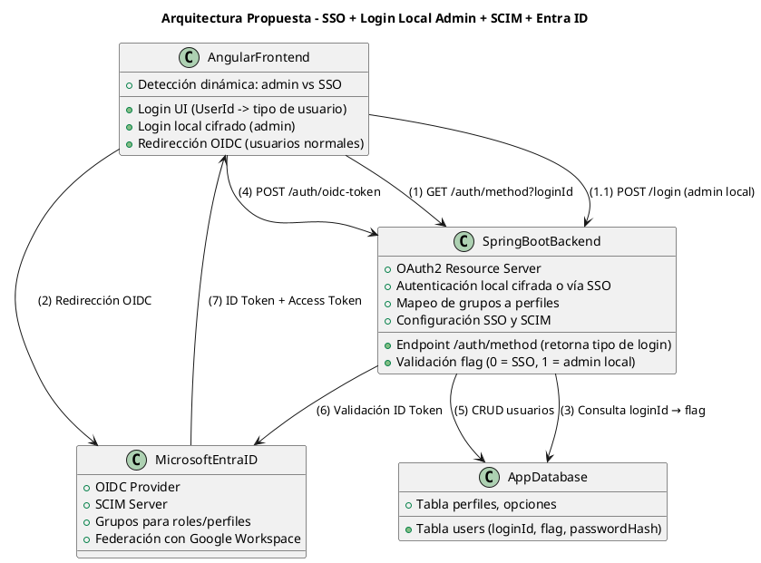

#  Backend - Autenticación Híbrida con Microsoft Entra ID (OIDC) y Login Local

##  Descripción General

Este servicio implementa una autenticación híbrida en el sistema, integrando **Microsoft Entra ID** mediante **OIDC (OpenID Connect)** para permitir **Single Sign-On (SSO)** para la mayoría de los usuarios. El usuario **administrador** conserva el flujo de autenticación local existente.

El sistema contempla además el **autoaprovisionamiento dinámico** de usuarios desde Entra ID usando información obtenida vía OIDC (ya que SCIM fue descartado por restricciones del cliente).

---

##  Objetivo

- Eliminar autenticación obsoleta basada en LDAP.
- Integrar SSO corporativo con Microsoft Entra ID.
- Mantener login local seguro para usuarios administradores.
- Proveer aprovisionamiento automático vía claims del ID Token.
- Garantizar seguridad con cifrado **AES** (local) y proyección futura con **RSA**.

---

##  Arquitectura General

Frontend: Angular  
Backend: Spring Boot  
Bases de datos: SQL Server (perfiles/usuarios), Oracle (otros)  
Proveedor de Identidad: Microsoft Entra ID (OIDC v2.0)  

>  **SCIM fue descartado**, el aprovisionamiento se hace al momento del login.

###  Diagrama de Arquitectura



---

###  Autoaprovisionamiento (por OIDC)

- Se crea o actualiza el usuario al momento del login vía OIDC.
- Se extraen los siguientes claims del ID Token: 
  - preferred_username → loginId
  - name → nombre completo
  - roles → lista de IDs de perfil
  - departamento → área organizacional
- Si el usuario no existe, se crea.
- Si ya existe, se actualiza con los datos nuevos.
- Se registra la fecha de último login.

---

### Token OIDC (Ejemplo)

```
{
  "preferred_username": "odominguez@davivienda.com",
  "name": "OSCAR FERNANDO DOMINGUEZ MORENO",
  "roles": ["15", "6"],
  "departamento": "TECNOLOGIA DE GESTION DOCUMENTAL",
  "perfil": "6",
  "aud": "f0871236-b6c7-4f95-8cb3-2a795227c0e1",
  "iss": "https://login.microsoftonline.com/d36775fa-f481-4695-86f4-41432c8f57af/v2.0"
}
```

---

###  Configuración Técnica

####  application.yml

```
spring:
  security:
    oauth2:
      resourceserver:
        jwt:
          jwk-set-uri: https://login.microsoftonline.com/d36775fa-f481-4695-86f4-41432c8f57af/discovery/v2.0/keys
```


####  Dependencias
```
<dependency>
  <groupId>org.springframework.boot</groupId>
  <artifactId>spring-boot-starter-oauth2-resource-server</artifactId>
</dependency>
<dependency>
  <groupId>com.nimbusds</groupId>
  <artifactId>nimbus-jose-jwt</artifactId>
  <version>9.37</version>
</dependency>
```

####  Archivo Weblogic.xml

- Se agrega el container-descriptor para que sea tenido en cuenta la dependencia en entorno de weblogic.

```
<container-descriptor>
        <prefer-application-packages>
            <package-name>com.nimbusds.*</package-name>
            <package-name>net.minidev.*</package-name>
            <package-name>com.fasterxml.jackson.*</package-name>
        </prefer-application-packages>
    </container-descriptor>
```

####  Endpoints Involucrados

```
@PostMapping("/security/auth/method")
public ResponseEntity<Map<String, Object>> authMethod(@RequestBody MethodAuthDTO dto)

@PostMapping("/security/auth/oidc-token")
public ResponseEntity<Map<String, Object>> oidcToken(@RequestBody OidcTokenRequest dto)
```

- /auth/method: Determina si el login es local (admin) o SSO.

- /auth/oidc-token: Valida el token de Entra ID y gestiona el aprovisionamiento.

####  Lógica de Aprovisionamiento en Código

El metodo contiene el flujo de aprovisionamiento, validación de usuario y actualización de los datos del usuario.

```
@Override
@Transactional
public UserDTO authenticationWithSSO(Jwt jwt) {
    String loginId = extractLoginId(jwt);
    String email = jwt.getClaimAsString("preferred_username");
    String name = jwt.getClaimAsString("name");
    List<String> groups = jwt.getClaimAsStringList("roles");
    String area = jwt.getClaimAsString("departamento");

    Optional<UserProfile> userOpt = Optional.ofNullable(userProfileRepository.findByLoginId(loginId));
    UserProfile user = userOpt
        .map(u -> updateExistingUser(u, email, name, groups, area))
        .orElseGet(() -> createNewUser(loginId, email, name, groups, area));

    validateUserStatus(user);
    updateUserLastLoginAndCleanOptions(user);
    return userMapper.toDTO(user, true);
}
```

####  Estructura del Usuario (respuesta del backend)

```
{
  "data": {
    "userId": 2,
    "loginId": "79344226",
    "name": "Oscar Fernando Dominguez Moreno",
    "email": "odominguez@davivienda.com",
    "flag": 0,
    "status": "A",
    "lastLoginDate": "2025-07-28T18:42:48",
    "perfiles": [
      {
        "id": 9,
        "nombre": "Gestion de usuarios",
        "descripcion": "Administrar la seguridad de la aplicacion"
      }
    ],
    "productos": [
      {
        "codProd": "0570",
        "codSubProd": "0000",
        "permissionLevel": "FULL"
      },
      ...
    ]
  },
  "jwt": "eyJhbGciOiJIUzI1NiJ9...",
  "message": "Login exitoso",
  "status": "success"
}
```

####  Filtro de Seguridad JWT

Clase: JwtFilter
Responsable de interceptar las peticiones y validar tokens internos u OIDC.

- Si el token es válido localmente → se autoriza.
- Si no, se intenta como OIDC.
- Si ambos fallan → 401 Unauthorized.

####  Ubicación del Código Clave

Ubicación del Código Clave

 - AuthController.java → Endpoints de autenticación
 - AuthServiceImpl.java → Lógica de login y aprovisionamiento
 - JwtFilter.java → Validación de tokens
 - application.yml → Configuración del JWK

---

####  Referencias

Fuentes:

Sincronización de SCIM con Microsoft Entra ID:
https://learn.microsoft.com/es-es/entra/architecture/sync-scim


Desarrollo de un punto de conexión de SCIM en Microsoft Entra ID
Tutorial: https://learn.microsoft.com/es-es/entra/identity/app-provisioning/use-scim-to-provision-users-and-groups

Uso de SCIM y Microsoft Graph para el aprovisionamiento de usuarios
Use SCIM, Microsoft Graph, and Microsoft Entra ID to provision users and enrich apps with data - Microsoft Entra ID | Microsoft Learn: https://learn.microsoft.com/en-us/entra/identity/app-provisioning/scim-graph-scenarios

Ejemplo implementación spring boot
GitHub - mraible/okta-scim-spring-boot-example: A SCIM Example with Apache SCIMple and Spring Boot: https://github.com/mraible/okta-scim-spring-boot-example 


SCIM Gateway para Microsoft Entra ID
Use SCIM, Microsoft Graph, and Microsoft Entra ID to provision users and enrich apps with data - Microsoft Entra ID | Microsoft Learn: https://learn.microsoft.com/en-us/entra/identity/app-provisioning/scim-graph-scenarios

Especificacion SCIM 2.0
System for Cross-domain Identity Management (scim): https://datatracker.ietf.org/wg/scim/documents/


Overview of the Microsoft Authentication Library (MSAL) - Microsoft identity platform | Microsoft Learn: https://learn.microsoft.com/en-us/entra/identity-platform/msal-overview

Graph API
Azure AD Graph API Entity and Complex Type Reference | Microsoft Learn: https://learn.microsoft.com/es-es/previous-versions/azure/ad/graph/api/entity-and-complex-type-reference#user-entity


